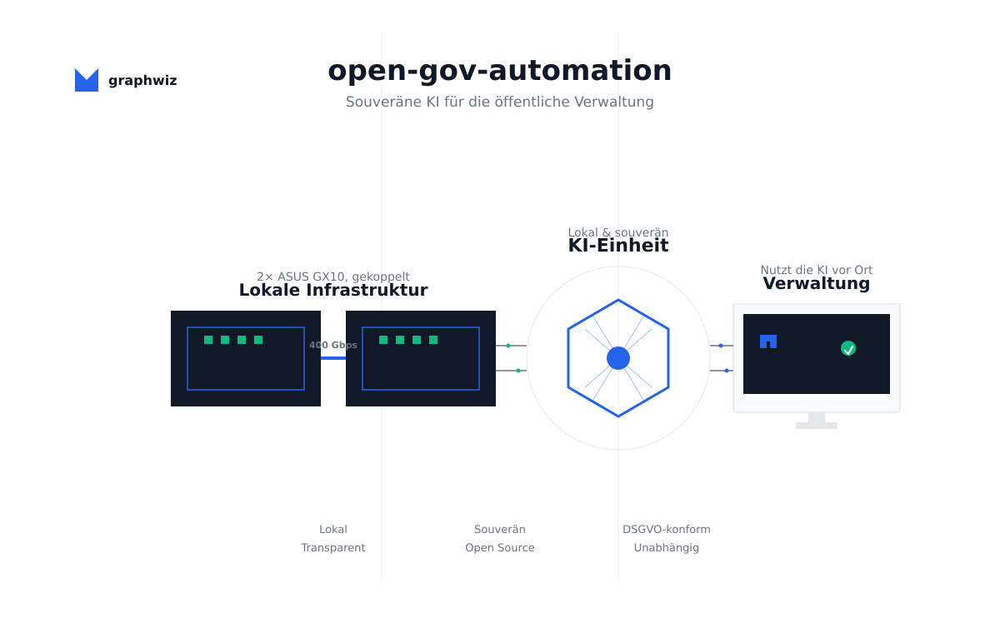

# open-gov-automation

**Souveräne KI für Kommunen. Lokal. Vorausschauend. Ohne Cloud-Zwang.**

[**▶ Live-Demo starten**](https://tobias-weiss-ai-xr.github.io/open-gov-automation/demo.html?auto=1) · [**Startseite öffnen**](https://tobias-weiss-ai-xr.github.io/open-gov-automation/)

Der Workflow in 2 Minuten: vorausschauende Bauantrags-Prüfung, Dual-Cluster-Failover, Hebelwirkung. (Frontend-Simulation, keine echten Daten.)

---

## Kurz & knapp

- **Problem:** Verwaltungen prüfen reaktiv — Rückläufe, lange Bearbeitung, Cloud-Abhängigkeit.
- **Lösung:** Lokale KI-Einheit aus 2 gekoppelten ASUS-GX10-Geräten prüft Bauanträge *vor* Einreichung. DSGVO-by-Design, keine US-Cloud, kein Lock-in.
- **Pilot:** 60.000 € für 6 Monate, danach betreiben Sie selbst. Amortisation < 12 Monate, ROI 207–515 %.

---

## Material

- [Projektskizze (60k-Pilot)](examples/60k-mesh-cluster-projekt.md)
- [Wirtschaftlichkeit & ROI](examples/wirtschaftlichkeit.md)
- [Lösungsvergleich: Cloud / SaaS](examples/loesungsvergleich.md)
- [Dezentraler Betrieb & Hebelwirkung](examples/dezentraler-betrieb.md)
- [Compliance: TOMs, VVT, DSFA](compliance/)
- [Design Guide](DESIGN-GUIDE.md)

---

## Kontakt

- **E-Mail:** [open-gov-automation@graphwiz.ai](mailto:open-gov-automation@graphwiz.ai)
- **Website:** [tobias-weiss-ai-xr.github.io/open-gov-automation](https://tobias-weiss-ai-xr.github.io/open-gov-automation/)
- **Lizenz:** Open Source (GPL-3.0)

---

## Impressum & Initiative

**Initiative:** Tobias Weiss IT-Services, Einzelunternehmer
**KI-Assistenz-Hinweis:** Diese Unterlagen wurden mit Unterstützung von KI-Assistenz erstellt. Die inhaltliche und rechtliche Verantwortung trägt Tobias Weiss IT-Services, Einzelunternehmer.

---

*KI als Werkzeug. Nicht als Blackbox. Nicht in der Cloud. Bei Ihnen.*
